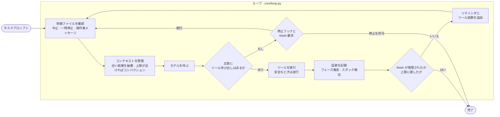
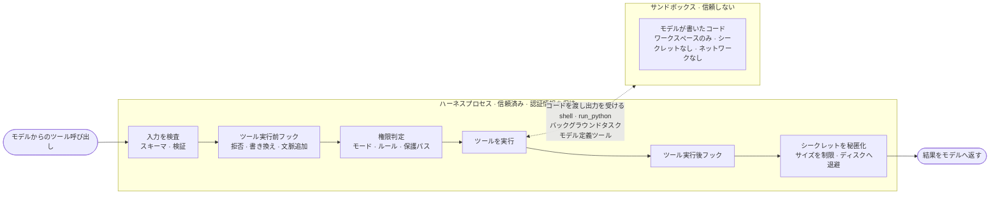

# harnessing_loop

**AIモデルを閉ループに組み込み、その仕事を検証する。**

エージェントの中核。VLM、ループ、ツール、サンドボックス、そしてゲート。そのまま使ってもよいし、この上にエージェント型アプリケーションを作ってもよい。

> 🌐 **English**: [README.md](README.md) · 📚 **日本語ドキュメント**: [docs/ja/](docs/ja/README.md) · 📖 **用語集**: [docs/ja/GLOSSARY.md](docs/ja/GLOSSARY.md)

## これは何か

harnessing_loop は、能力あるエージェントの中核である。1つの VLM と、ツール群を伴う反復機構を使い、自分の仕事を自分で検査する。モデルが提案し、ツールが実行し、結果が戻り、ゲートが完了を判断する。

フレームワークではない。複数エージェントのオーケストレーションでもない。これは単一のエージェントであり、VLM を頭脳として、与えられたツールを使い、任された仕事を終えるまで動く。実用的なチャットエージェントとして、サンドボックス付きのコーダーとして、あるいはフェーズ・コンパクション・再開可能なジョブ・Web UI を備えた本格的なアプリケーションの土台として使える。

## これで何が作れるか

同じループでも、プロファイルを変えれば次のような仕事を扱える。

| 仕事 | ツール | ゲート |
|---|---|---|
| ツールを使うチャットアシスタント | カレンダー、検索、社内 API | 回答が出典を示している |
| コーディングエージェント | 編集、テスト実行、修正、反復 | テストが通る |
| 文書処理 | PDF やスキャンから構造化レコードへ | スキーマ検査と項目間の検算 |
| データパイプライン | CSV の整形、変換の作成、実行 | 行数と制約が保たれている |
| 設計と CAD | 図面からジオメトリを構築 | 図面の数値に対してジオメトリを検証 |
| 調査とレポート | 検索、読解、ディスクへのメモ、執筆 | すべての主張に出典がある |
| 移行 | 言語やフレームワーク間のコード変換 | 既存のテストスイートが通る |
| 運用手順書 | 読み取り専用ツールで診断し、修正案を出す | 書き込み系ツールの前に人間が承認する |
| QA とブラウザエージェント | UI を操作し、期待状態と比較 | スクリーンショットと状態が一致する |
| 評価ループ | タスク集合に対してモデルを走らせ、採点し、改善 | スコアが上がる |

## クイックスタート

```bash
pip install -e ".[dev]"            # ライブラリとテスト依存。APIキーはまだ不要
python -m pytest -q                # 台本化されたモデルで108件のテスト。API課金ゼロ

python examples/chat_cli.py        # チャットエージェント、オフラインデモ
python examples/coder_cli.py       # サンドボックス付きコーダー、オフラインデモ
python examples/app_demo/run.py    # 検証ゲート付きのフェーズ制アプリケーション
python -m server.app --root ./jobs # HTTP API、ジョブキュー、Webページ
```

実際のモデルを使う場合。

```bash
pip install -e ".[anthropic]"      # 直接APIクライアント。クラウド経由なら ".[bedrock]"
export ANTHROPIC_API_KEY=...       # ハーネスが保持する。サンドボックスからは見えない
python examples/coder_cli.py "add a --json flag to cli.py" --workspace ./work --model <model-id>
hloop run "summarize this folder" --profile chat --workspace ./work --model <model-id>
```

Windows の PowerShell では `export` の代わりに次を使う。

```powershell
$env:ANTHROPIC_API_KEY = "..."
```

コードから使う場合。

```python
from harnessing_loop import Loop, load_profile

runtime = load_profile("coder").build("./work", model="<model-id>")
result = Loop(runtime).run("Write fizzbuzz.py and run it.")
print(result.reason, result.final_text)
```

## どう動くか

### ループ

毎ターン、モデルが提案し、ツールが動き、結果が戻る。実行が終わるのは、ゲートが完了を認めたときだけである。



### 1回のツール呼び出し

すべてのツール呼び出しは、信頼されたハーネスプロセス内で同じパイプラインを通る。サンドボックスに渡るのはモデルが書いたコードだけである。



コードが守っている7つの規則。

1. **エラーは結果である。** ツールはループに例外を投げない。あらゆる失敗は、モデルが読んで対処できるテキストになる。
2. **本当の状態はディスクにある。** 会話は使い捨てであり、いつ要約されてもよい。ノート、TODO、トランスクリプト、チェックポイント、制御ファイルはファイルである。
3. **規則は権限とフックにあり、ループにはない。** ループはターンを回すだけである。
4. **進捗は証跡から推定する。** 書かれたファイル、通った検証。モデルの発言からではない。
5. **シークレットはサンドボックスに入らない。** ハーネスが認証情報を保持し、モデル呼び出しを自ら行う。
6. **フェイクモデルが初日から存在する。** すべての機構が API 課金ゼロで検証できる。
7. **プロファイルは1つの YAML ファイルである。** チャットからコーダー、アプリケーションへの切り替えで変わるのはプロファイルであり、中核ではない。

## 構成

```
harnessing_loop/
├── core/          ループ、メッセージ、実行状態、イベント、コスト、ランタイム
├── llm/           モデルクライアント規約、直接/クラウド経由クライアント、フェイクモデル、再試行、キャッシュ配置
├── tools/         ツール規約、レジストリ、ディスパッチャ、パイプライン、サイズ制御、ファイル状態、packs/
├── safety/        権限、ルール、フック、ガード、秘匿化
├── sandbox/       local / docker / remote バックエンド、ポリシー、起動時検査
├── context/       トークン計算、コンパクション、マイクロコンパクション、再構築、添付、システムプロンプト
├── persistence/   トランスクリプト、チェックポイント、メモリ、ノート、制御ファイル
├── progress/      フェーズ、ゲート、証跡、スタック検出
├── profiles/      chat.yaml、coder.yaml、template_app.yaml とローダー
└── skills/        SKILL.md ローダーと同梱の verify スキル
server/            HTTP API、SQLite ジョブテーブル、スケジューラ、ワーカー、1ページ
examples/          chat_cli.py、coder_cli.py、app_demo/
evals/             タスク集合とプロファイルを採点する実行器
tests/             108件のテスト。フェイクモデルのみ
docs/              層ごとに1本、読む順に並べた文書
docs/ja/           その日本語訳
```

## ドキュメントは順に読む

| | 文書 | 扱う内容 |
|---|---|---|
| 1 | [docs/ja/01_loop.md](docs/ja/01_loop.md) | 1回の反復、終了理由、ランタイム、イベント |
| 2 | [docs/ja/02_tools.md](docs/ja/02_tools.md) | ツール規約、パイプライン、ディスパッチャ、パック |
| 3 | [docs/ja/03_results_and_context.md](docs/ja/03_results_and_context.md) | サイズ制御、ファイル状態、トークン計算、秘匿化 |
| 4 | [docs/ja/04_state_on_disk.md](docs/ja/04_state_on_disk.md) | トランスクリプト、再開、チェックポイント、制御ファイル、メモリ |
| 5 | [docs/ja/05_permissions_and_hooks.md](docs/ja/05_permissions_and_hooks.md) | モード、ルール、判定順序、フック規約 |
| 6 | [docs/ja/06_sandbox.md](docs/ja/06_sandbox.md) | 信頼境界、環境変数の除去、コンテナのフラグ、起動時検査 |
| 7 | [docs/ja/07_compaction.md](docs/ja/07_compaction.md) | しきい値、要約の節、再構築、キャッシュ配置 |
| 8 | [docs/ja/08_progress.md](docs/ja/08_progress.md) | フェーズ、ゲート、証跡、スタック検出 |
| 9 | [docs/ja/09_scaling_tools.md](docs/ja/09_scaling_tools.md) | 遅延ツール、サブエージェント、バックグラウンドタスク、モデル定義ツール、スキル |
| 10 | [docs/ja/10_application.md](docs/ja/10_application.md) | ジョブ、ワーカー、イベント配信、自分のものにする方法 |

訳語は [docs/ja/GLOSSARY.md](docs/ja/GLOSSARY.md) に従う。英語版は [docs/](docs/01_loop.md) にある。

## プロファイル

| プロファイル | ツール | サンドボックス | 権限 | 終了条件 |
|---|---|---|---|---|
| `chat` | 読み取り専用ファイル、web | なし | 読み取り専用は実行。それ以外は存在しない | モデルが止まったとき |
| `coder` | files、exec、planning、tasks、meta | local（開発用）または docker | ワークスペース内の編集は実行。shell は allow ルールか許可が必要 | `finish` が TODO ゲートを通ったとき |
| `template_app` | すべて。一部は遅延 | local（開発用）または docker | 無人実行。確認を要するものは拒否 | `finish` が検証ゲートを通ったとき |

自分用のものを作るには `harnessing_loop/profiles/template_app.yaml` を複製する。すべてのキーがそこに説明されている。

## 安全性モデルを一段落で

ハーネスプロセスは信頼される。認証情報を保持し、モデルを呼び、入力を検証し、パス検査を伴ってファイルツールを実行する。サンドボックスは信頼されない。モデルが書いたものを実行し、見えるのはワークスペースと明示された環境変数だけで、ポリシーがドメインを許可しない限りネットワークもない。local バックエンドは環境変数を除去するがファイルシステムを隔離できないため、プロファイルが `allow_unsafe_local: true` と言わない限り、起動時検査が exec ツールの起動を拒否する。自分の機械を超える用途では docker か remote バックエンドを使う。権限にはバイパス不可の検査（deny ルール、内容依存の ask ルール、保護された設定パス）があるため、どのモードでもエージェント自身の規則を書き換えさせることはできない。

## 要件

Python 3.11 以上。`pyyaml`。任意の追加依存は、直接クライアント用の `anthropic`、クラウド経由クライアント用の `bedrock`。コンテナサンドボックスには Docker。

## ライセンス

Apache License 2.0。[LICENSE](LICENSE) を参照。
