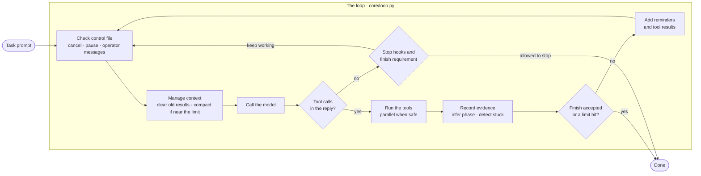
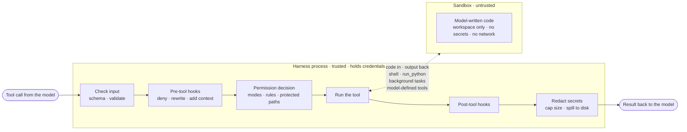

# harnessing_loop

**Harnessing an AI model in a closed-loop system and verifying the work.**

The core of an agent: a VLM, a loop, tools, a sandbox, and gates. Use it as it is, or build agentic applications on top of it.

## What it is

harnessing_loop is the core of a capable agent. It uses one VLM and a looping mechanism with a set of tools, and it checks its own work. The model proposes, tools execute, results feed back, and gates decide when the job is done.

It is not a framework and not an orchestrated set of agents. It is a single agent that uses the VLM as its brain and the provided tools until it completes the job it was assigned. Use it as a working chat agent, a sandboxed coder, or the base of a full application with phases, compaction, resumable jobs and a web UI.

## What you can build with it

The same loop, with a different profile, covers tasks such as:

| Task | Tools | The gate |
|---|---|---|
| Chat assistant with tools | calendar, search, internal APIs | the answer cites its sources |
| Coding agent | edit, run tests, fix, repeat | tests pass |
| Document processing | PDF or scan to structured records | schema checks and cross-field arithmetic |
| Data pipelines | clean a CSV, write a transform, run it | row counts and constraints hold |
| Engineering and CAD | build geometry from drawings | geometry verified against the drawing's numbers |
| Research and reports | search, read, take notes to disk, write | every claim has a source |
| Migrations | translate code between languages or frameworks | the old test suite passes |
| Ops runbooks | diagnose with read-only tools, propose a fix | a human approves before any write tool runs |
| QA and browser agents | drive a UI, compare against expected states | screenshots and states match |
| Evaluation loops | run a model against a task set, score, improve prompts | the score goes up |

## Quick start

```bash
pip install -e ".[dev]"            # library and test deps; no API key needed yet
python -m pytest -q                # 108 tests on a scripted model, zero API spend

python examples/chat_cli.py        # chat agent, offline demo
python examples/coder_cli.py       # sandboxed coder, offline demo
python examples/app_demo/run.py    # phased application with a verifier gate
python -m server.app --root ./jobs # HTTP API, job queue, web page
```

With a real model:

```bash
pip install -e ".[anthropic]"      # direct API client, or ".[bedrock]" for the cloud-hosted client
export ANTHROPIC_API_KEY=...       # the harness holds this; the sandbox never sees it
python examples/coder_cli.py "add a --json flag to cli.py" --workspace ./work --model <model-id>
hloop run "summarize this folder" --profile chat --workspace ./work --model <model-id>
```

In code:

```python
from harnessing_loop import Loop, load_profile

runtime = load_profile("coder").build("./work", model="<model-id>")
result = Loop(runtime).run("Write fizzbuzz.py and run it.")
print(result.reason, result.final_text)
```

## How it works

### The loop

Every turn, the model proposes, tools act, and the results feed back. The run ends only when the gates agree the job is done.



### One tool call

Every tool call passes through the same pipeline in the trusted harness process. Only model-written code crosses into the sandbox.



Seven rules the code follows:

1. **Errors are results.** A tool never raises to the loop. Every failure becomes text the model can read and act on.
2. **Real state lives on disk.** The conversation is disposable and can be summarized at any time. Notes, todos, transcript, checkpoints and the control file are files.
3. **Rules live in permissions and hooks, not in the loop.** The loop only runs turns.
4. **Progress is inferred from evidence.** A file written, a verifier passed. Not from what the model says.
5. **Secrets never enter the sandbox.** The harness holds credentials and makes the model calls itself.
6. **A fake model exists from day one.** Every mechanism is testable with zero API spend.
7. **A profile is one YAML file.** Switching from chat to coder to application changes the profile, not the core.

## Layout

```
harnessing_loop/
├── core/          loop, messages, run state, events, cost, runtime
├── llm/           model client protocol, direct and cloud-hosted clients, fake model, retry, cache layout
├── tools/         tool protocol, registry, dispatcher, pipeline, size control, file state, packs/
├── safety/        permissions, rules, hooks, guards, redaction
├── sandbox/       local, docker, remote backends; policy; startup check
├── context/       token accounting, compaction, microcompaction, rebuild, attachments, system prompt
├── persistence/   transcript, checkpoints, memory, notes, control file
├── progress/      phases, gates, evidence, stuck detection
├── profiles/      chat.yaml, coder.yaml, template_app.yaml, and the loader
└── skills/        SKILL.md loader and the bundled verify skill
server/            HTTP API, SQLite job table, scheduler, worker, one page
examples/          chat_cli.py, coder_cli.py, app_demo/
evals/             tasks and a runner that scores a profile
tests/             108 tests, fake model only
docs/              one document per layer, in reading order
```

## Read the docs in order

| | Document | Covers |
|---|---|---|
| 1 | [docs/01_loop.md](docs/01_loop.md) | one iteration, exit reasons, runtime, events |
| 2 | [docs/02_tools.md](docs/02_tools.md) | the tool protocol, pipeline, dispatcher, packs |
| 3 | [docs/03_results_and_context.md](docs/03_results_and_context.md) | size control, file state, token accounting, redaction |
| 4 | [docs/04_state_on_disk.md](docs/04_state_on_disk.md) | transcript, resume, checkpoints, control file, memory |
| 5 | [docs/05_permissions_and_hooks.md](docs/05_permissions_and_hooks.md) | modes, rules, decision order, hook contract |
| 6 | [docs/06_sandbox.md](docs/06_sandbox.md) | trust zones, env scrubbing, container flags, startup check |
| 7 | [docs/07_compaction.md](docs/07_compaction.md) | thresholds, summary sections, rebuild, cache layout |
| 8 | [docs/08_progress.md](docs/08_progress.md) | phases, gates, evidence, stuck detection |
| 9 | [docs/09_scaling_tools.md](docs/09_scaling_tools.md) | deferred tools, subagents, background tasks, model-defined tools, skills |
| 10 | [docs/10_application.md](docs/10_application.md) | jobs, workers, event streaming, making it yours |

## Profiles

| Profile | Tools | Sandbox | Permissions | Ends when |
|---|---|---|---|---|
| `chat` | read-only files, web | none | read-only runs; nothing else exists | the model stops |
| `coder` | files, exec, planning, tasks, meta | local (dev) or docker | edits inside the workspace run; shell needs an allow rule or a yes | `finish` passes the todo gate |
| `template_app` | everything, several deferred | local (dev) or docker | unattended; anything that would ask is denied | `finish` passes the verifier gate |

Copy `harnessing_loop/profiles/template_app.yaml` to start your own. Every key is documented there.

## Safety model in one paragraph

The harness process is trusted: it holds credentials, calls the model, validates inputs, and runs file tools with path checks. The sandbox is untrusted: it runs whatever the model wrote, sees only the workspace and an explicit environment, and has no network unless a policy allows a domain. The local backend scrubs the environment but cannot isolate the filesystem, so the startup check refuses exec tools on it unless the profile says `allow_unsafe_local: true`. Use the docker or remote backend for anything beyond your own machine. Permissions have bypass-immune checks (deny rules, content-specific ask rules, protected config paths) so no mode can talk the agent into editing its own rules.

## Requirements

Python 3.11 or newer. `pyyaml`. Optional extras: `anthropic` for the direct client, `bedrock` for the cloud-hosted client. Docker for the container sandbox.

## License

Apache License 2.0. See [LICENSE](LICENSE).
